# LabSim — manual del estudiante

Cómo entrar a la app, atender a un paciente simulado y usar cada equipo del laboratorio.

**Autores**

- Nicolás Baier-Quezada
- Vanessa Uribe-Hernández
- Fernanda López-Moncada
- Cristina Vargas-Bustamante

TecMedHub · Universidad Austral de Chile, Sede Puerto Montt

**Contenido**

| Parte | Contenido |
|---|---|
| **Guía rápida** | Del curso en línea al paciente atendido, paso a paso: el código, la agenda, la atención, los exámenes y el cierre |
| **I — Entrar** | Qué es LabSim, cómo se ingresa, la ventana principal y qué pasa con la sesión |
| **II — Atender** | La agenda, la práctica libre, la ficha, la conversación con el paciente, el cierre y lo que queda guardado |
| **III — Tu avance en la web** | Mis pacientes en la web: cómo vas, tu técnica de audiometría, el detalle de cada atención, los informes y la ficha de estudio |
| **IV — Box Audiología** | Audiómetro, instrucciones al paciente, enmascaramiento, logoaudiometría, supraliminares, acumetría, otoscopía e impedanciómetro |
| **V — Box Electrofisiología** | ABR, electrococleografía, AABR, emisiones otoacústicas y VEMP |
| **VI — Ajustes y problemas** | Atajos de teclado, controlador LabSim, mouse para zurdos, reportar un problema y problemas frecuentes |

> **Aviso sobre las imágenes.** Las capturas son de la aplicación real, con pacientes inventados para este manual (los mismos de la práctica libre). Los nombres, RUT y fechas no corresponden a personas reales. Lo que muestre tu pantalla puede variar según los equipos que tu curso tenga habilitados.

---

# Guía rápida

De la actividad del curso a la atención cerrada. Lo más importante es **cerrar la atención** al terminar (paso 8): mientras no la cierres, el paciente sigue "en atención".

1Pide el código de ingreso

Abre la actividad <strong>LabSim</strong> de tu curso en la plataforma de tu universidad (por ejemplo, Moodle). La página muestra <em>«Ingreso correcto»</em> y un <strong>código de 6 dígitos</strong> que vence en unos minutos. Si venció, <em>Generar código nuevo</em>.

2Entra a LabSim

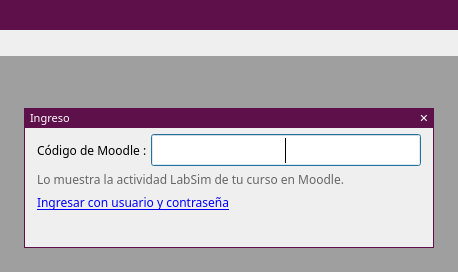

En LabSim, <em>Ingresar</em> (arriba a la derecha) y escribe el código en <strong>Código de ingreso</strong>. Al completar los 6 dígitos entra solo.

3Abre la agenda

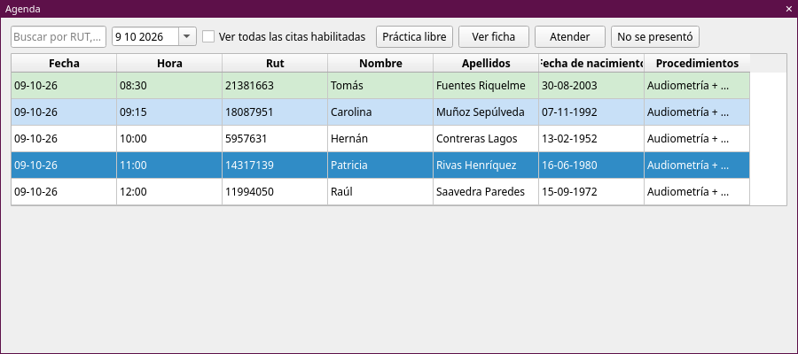

En <em>Sala de Espera</em>, botón <strong>AGENDA</strong>: tus pacientes del día. Para los pacientes de práctica, <strong>Práctica libre</strong> (parte II).

4Atiende

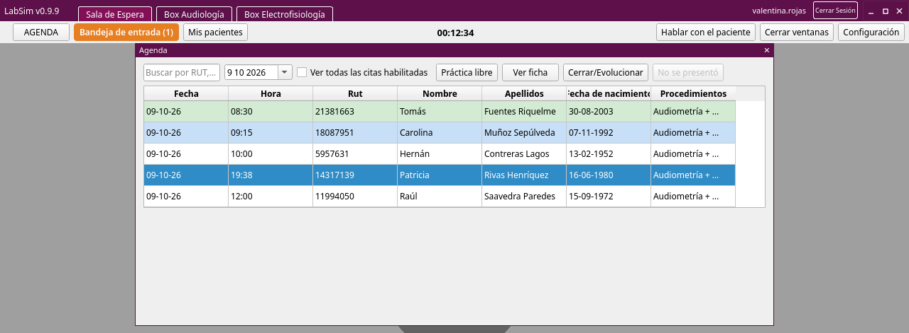

Elige al paciente y <strong>Atender</strong> (o <strong>Practicar</strong>). Arriba corre el cronómetro y abajo dice <em>«Estás atendiendo a…»</em>.

5Lee la ficha y conversa

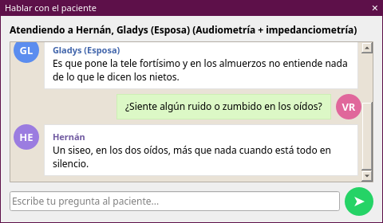

<em>Ver ficha</em> muestra los datos y el historial. <strong>Hablar con el paciente</strong> abre la entrevista: escribe como le hablarías.

6Ve al box y toma los exámenes

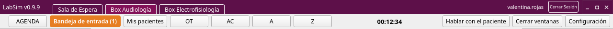
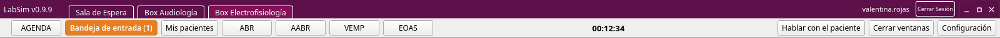

<strong>Box Audiología</strong>: otoscopía (OT), acumetría (AC), audiómetro (A) e impedanciómetro (Z). <strong>Box Electrofisiología</strong>: ABR, AABR, VEMP y EOAS. Los botones son los equipos del box.

7El informe se guarda solo

No hay botón Guardar. Bajo cada equipo, una línea dice cuándo se guardó: <em>«informe guardado a las HH:MM»</em>. Sin internet se guarda en el equipo y se sube cuando vuelve.

8Cierra la atención

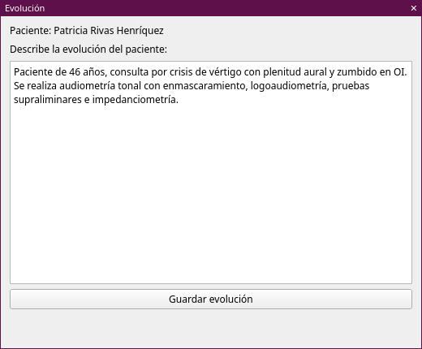

En la agenda, <strong>Cerrar/Evolucionar</strong>: escribe la evolución y <em>Guardar evolución</em>. Recién ahí la atención queda cerrada.

---

# Parte I — Entrar

Esta parte cuenta qué es LabSim, cómo se ingresa con el código de ingreso, cómo está organizada la ventana y qué pasa con la sesión.

## 1. Qué es LabSim

LabSim es un laboratorio simulado de evaluación auditiva y vestibular. En el computador abres la app, recibes a un paciente simulado y lo evalúas con los mismos pasos que en el laboratorio real: lees su ficha, conversas con él, le das instrucciones y tomas los exámenes con equipos que funcionan como los de verdad. El paciente responde según su caso: levanta la mano cuando oye, dice «sí» o «no», o simplemente no responde.

Lo que haces queda registrado (los exámenes, la conversación y tu evolución) y tu docente lo revisa después. Hay dos maneras de atender:

| Cómo | Qué es |
|---|---|
| **Cita de la agenda** | Un paciente que tu docente te agendó para un práctico, con fecha y hora |
| **Práctica libre** | Pacientes que tu docente dejó para practicar cuando quieras, las veces que quieras |

## 2. Ingresar

### 2.1 El código de ingreso

LabSim no tiene contraseña propia para los estudiantes: entras con un **código de ingreso** de 6 dígitos que te da la actividad LabSim de tu curso, en la plataforma de tu universidad (Moodle u otra).

1. En la plataforma del curso, abre la actividad LabSim.
2. La página dice *«Ingreso correcto»* y muestra el código, con *«Vence en N segundos»*. Si se venció, usa *Generar código nuevo*.
3. Abre LabSim en el computador y haz clic en **Ingresar** (arriba a la derecha).
4. En la ventana **Ingreso**, escribe el código en **Código de ingreso**. Al completar los 6 dígitos, LabSim entra solo: no hay que hacer clic en nada.

El link de abajo, *Ingresar con usuario y contraseña*, es para los docentes; desde ahí, *Ingresar con código de ingreso* vuelve al código.

Mientras conecta aparece *«Conectando con el servidor...»*. Al entrar, arriba a la derecha aparece tu usuario y el botón cambia a **Cerrar Sesión**.

### 2.2 Si no puedes entrar

| Mensaje | Qué hacer |
|---|---|
| *Código inválido, ya usado o expirado* | El código se usa una vez y vence en minutos. Genera uno nuevo en la actividad del curso |
| *No hay conexión con el servidor. Revisa la red e inténtalo de nuevo.* | El computador no tiene internet o el servidor no responde |
| *Demasiados intentos fallidos…* | Espera unos minutos antes de volver a intentarlo |
| *Tu cuenta está bloqueada. Habla con tu docente.* | Solo tu docente puede desbloquearla |
| *Sin módulos habilitados* | Tu cuenta no tiene equipos habilitados en el curso: avísale a tu docente |

## 3. La ventana principal

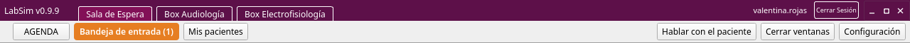

La ventana tiene tres partes:

- **Arriba, las secciones**: *Sala de Espera*, *Box Audiología* y *Box Electrofisiología*. Cada sección muestra sus propios botones.
- **Debajo, los botones de la sección** a la izquierda, el **cronómetro** de la atención al centro y, a la derecha, *Hablar con el paciente*, *Cerrar ventanas* y *Configuración*.
- **Abajo, la barra de estado**: mientras atiendes dice *«Estás atendiendo a: RUT … — Fecha de nacimiento …»*.

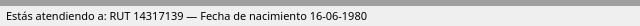

| Sección | Botones |
|---|---|
| **Sala de Espera** | **AGENDA**, **Bandeja de entrada** y **Mis pacientes** |
| **Box Audiología** | **OT** otoscopía · **AC** acumetría · **A** audiómetro · **Z** impedanciómetro |
| **Box Electrofisiología** | **ABR** potencial evocado de tronco · **AABR** tamizaje automatizado · **VEMP** potenciales vestibulares · **EOAS** emisiones otoacústicas |

Los botones de los equipos llevan su sigla; al dejar el mouse encima aparece el nombre completo. Solo ves los equipos que tu curso tiene habilitados.

Cada equipo se abre como una ventana dentro de LabSim, con su nombre arriba y una **✕** para cerrarla. Cerrar una ventana no borra lo que hiciste: al volver a abrirla está igual. **Cerrar ventanas** las cierra todas de una vez (útil si una quedó tapada o corrida).

## 4. La sesión

### 4.1 Cerrar sesión

**Cerrar Sesión** cierra de inmediato, sin preguntar. Antes de cerrar guarda lo que tengas en curso: el borrador de la evolución y los informes. Si tenías una atención abierta, sigue abierta y la puedes **retomar** al volver a entrar.

### 4.2 Sesión vencida o cuenta bloqueada

La sesión dura un tiempo fijo desde que ingresas (normalmente 12 horas, lo decide tu docente). Cuando vence, LabSim avisa y te devuelve al ingreso:

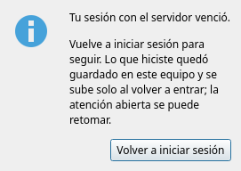

Lo que hiciste queda guardado en el computador y se sube solo cuando vuelves a entrar; la atención abierta se puede retomar. Si el aviso dice **Cuenta bloqueada**, habla con tu docente.

### 4.3 Actualizaciones y conexión

- Cuando hay una versión nueva, LabSim la ofrece al abrir (*«Actualización disponible»*) y se reinicia solo al terminar. En los computadores del laboratorio se actualiza sin preguntar.
- Si LabSim abre sin conexión, el título dice *«sin conexión»*. Para **abrir** una atención hace falta internet; una vez abierta, se puede trabajar sin red y lo hecho se sube cuando vuelve.
- Si la vez anterior LabSim se cerró de forma inesperada, al abrir pregunta si quieres enviar el registro para encontrar la causa. No se envía nada de lo que hiciste en los exámenes.

---

# Parte II — Atender

Esta parte recorre una atención completa: encontrar al paciente, abrir la atención, leer la ficha, conversar, tomar los exámenes y cerrar.

## 5. La agenda

**AGENDA** (en *Sala de Espera*) muestra tus citas del día elegido. Las columnas son *Fecha*, *Hora*, *Rut*, *Nombre*, *Apellidos*, *Fecha de nacimiento* y *Procedimientos*.

| Control | Para qué |
|---|---|
| **Buscar por RUT, nombre o apellido...** | Filtra la lista (también por fecha de nacimiento y procedimiento) |
| **Fecha** | Elige el día; los feriados salen en rojo en el calendario |
| **Ver todas las citas habilitadas** | Muestra todas tus citas, de cualquier día |
| **Práctica libre** | Cambia a la lista de práctica (sección 6) |
| **Ver ficha** | Abre la ficha clínica del paciente seleccionado |
| **Atender** | Abre la atención del paciente seleccionado |
| **No se presentó** | Marca la inasistencia; se habilita cuando ya pasó la hora de la cita |

El color de cada fila dice en qué está:

| Color | Estado |
|---|---|
| Celeste | En atención |
| Verde | Atendido |
| Rojo claro | No se presentó |

El botón principal cambia según el paciente elegido: **Atender** para abrir la atención; **Cerrar/Evolucionar** si es el paciente que estás atendiendo; y **Atender** otra vez para **retomar** una atención que quedó abierta (por ejemplo, si cerraste LabSim). Una atención ya cerrada no se puede volver a abrir.

> Solo puedes tener **una atención abierta a la vez**. Si intentas atender a otro, LabSim te pide cerrar primero la que tienes.

## 6. Práctica libre

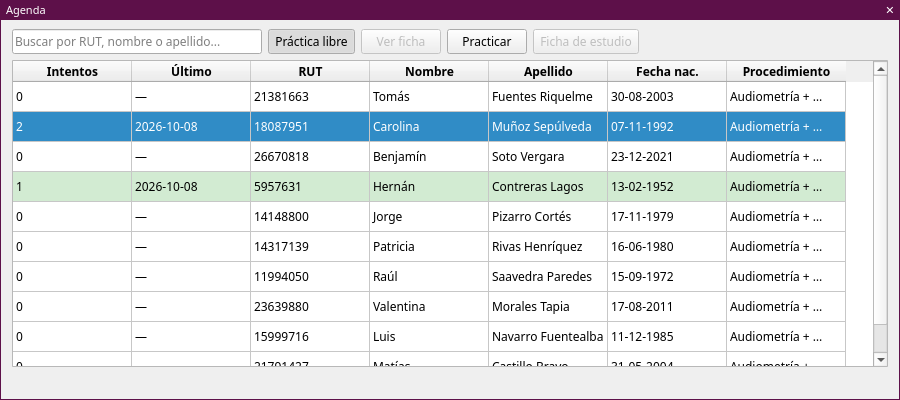

**Práctica libre** cambia la agenda por la lista de pacientes que tu docente dejó para practicar. Puedes atenderlos cuando quieras y las veces que quieras: cada vez es un **intento** nuevo, separado de los demás.

| Columna | Qué dice |
|---|---|
| **Intentos** | Cuántas veces cerraste una atención de ese paciente |
| **Último** | Fecha de tu último intento cerrado |
| **Procedimiento** | Qué exámenes se esperan (deja el mouse encima para ver el curso) |

- **Practicar** abre un intento nuevo. Desde ahí es igual que una cita: ficha, conversación, exámenes y cierre.
- Si dejaste un intento a medias, el botón dice **Retomar**: vuelve al mismo intento.
- **Ficha de estudio** abre, en PDF, los resultados del caso para comparar con tu último intento cerrado. Solo aparece si tu docente la dejó disponible y después de cerrar al menos un intento.

Los intentos de práctica no aparecen como citas en la agenda ni cuentan como prácticos.

## 7. Durante la atención

### 7.1 La ficha clínica

**Ver ficha** abre la ficha del paciente: sus datos, la **puntualidad** (hora agendada e inicio real) y el **historial**, con las atenciones previas que trae el paciente.

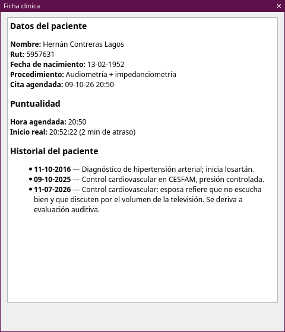

### 7.2 Hablar con el paciente

**Hablar con el paciente** abre la entrevista. Escribe tu pregunta y presiona **Enter** o **➤**. El paciente contesta como lo haría en la consulta, según lo que sabe de sí mismo y cuánta conciencia tiene de su problema.

- Si el paciente viene **acompañado** (un niño con su madre, un adulto mayor con su esposa), el encabezado dice a quiénes estás atendiendo. No eliges a quién le hablas: nómbralo al escribir y contesta quien corresponda.
- Mientras se prepara la respuesta aparece *«Pensando la respuesta…»*.
- Si no llega (sin conexión, o el servidor no respondió), abajo aparece *«No hubo respuesta. Puedes reintentar.»* y el botón **Reintentar**, que vuelve a enviar la misma pregunta: no hay que escribirla de nuevo.
- La conversación queda guardada con la atención; tu docente la lee y puede dejarte comentarios.

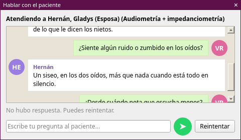

### 7.3 Los avisos de la secretaria

Mientras atiendes, **Karime**, la secretaria del centro, aparece abajo a la derecha para apurarte, como pasa en una consulta real: que el siguiente paciente ya llegó o que se está haciendo tarde. Los avisos se cierran solos.

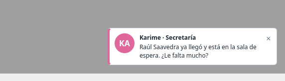

## 8. Cerrar la atención

Al terminar, en la agenda elige al paciente y **Cerrar/Evolucionar**. Se abre la ventana **Evolución**:

1. Escribe la evolución del paciente.
2. **Guardar evolución**.

Al guardar, LabSim sube los informes de los exámenes y recién después marca la atención como cerrada. Mientras escribes, la evolución se guarda como borrador en el computador: si se cierra LabSim, no se pierde.

Si no se pudo cerrar (sin conexión, sesión vencida), LabSim lo dice: tus exámenes y lo que escribiste quedan guardados en el computador y la atención sigue abierta. Vuelve a guardar la evolución cuando se resuelva.

### 8.1 Lo que queda guardado

No hay botón **Guardar** en ningún equipo. Cada informe se guarda solo mientras atiendes: cada pocos minutos si cambió algo, al cerrar la ventana del equipo y al cerrar la atención. Bajo cada equipo, una línea dice cómo va:

| Aviso | Qué significa |
|---|---|
| *El informe se guarda solo mientras atiendes.* | Todavía no hay nada que guardar |
| *informe guardado a las HH:MM.* | Subido al servidor |
| *sin conexión con el servidor: guardado en este equipo a las HH:MM…* | Quedó en el computador y se sube solo cuando vuelva la conexión |
| *no se pudo guardar a las HH:MM (…). Se reintenta solo.* | Hubo un error; LabSim vuelve a intentarlo |

## 9. Bandeja de entrada

**Bandeja de entrada** (en *Sala de Espera*) junta los mensajes de tu docente y los de la **OIRS simulada**. El botón muestra entre paréntesis cuántos tienes sin leer.

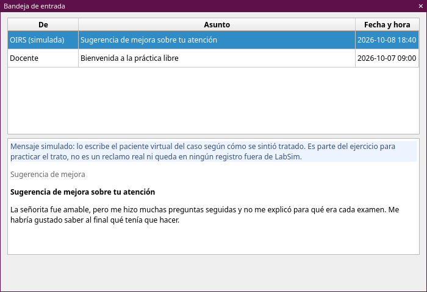

La OIRS es parte del ejercicio: después de la atención, el paciente virtual puede dejarte una *sugerencia de mejora* o una *felicitación* según cómo se sintió tratado. Es un mensaje simulado para practicar el trato: no es un reclamo real ni queda registrado fuera de LabSim.

## 10. Mis pacientes

**Mis pacientes** (en *Sala de Espera*) muestra las atenciones que ya cerraste. Los intentos de práctica llevan *· práctica* junto al procedimiento.

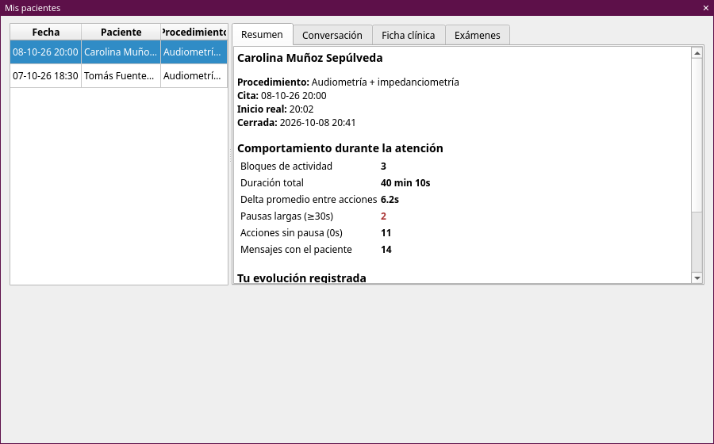

| Pestaña | Qué tiene |
|---|---|
| **Resumen** | Horarios, cómo trabajaste (bloques de actividad, pausas, mensajes), tu evolución y los comentarios de tu docente |
| **Conversación** | La entrevista completa; los globos amarillos son comentarios de tu docente sobre ese turno |
| **Ficha clínica** | La ficha del paciente |
| **Exámenes** | Los informes guardados. El ABR se puede abrir con **Ver en el ABR**, solo para mirarlo |

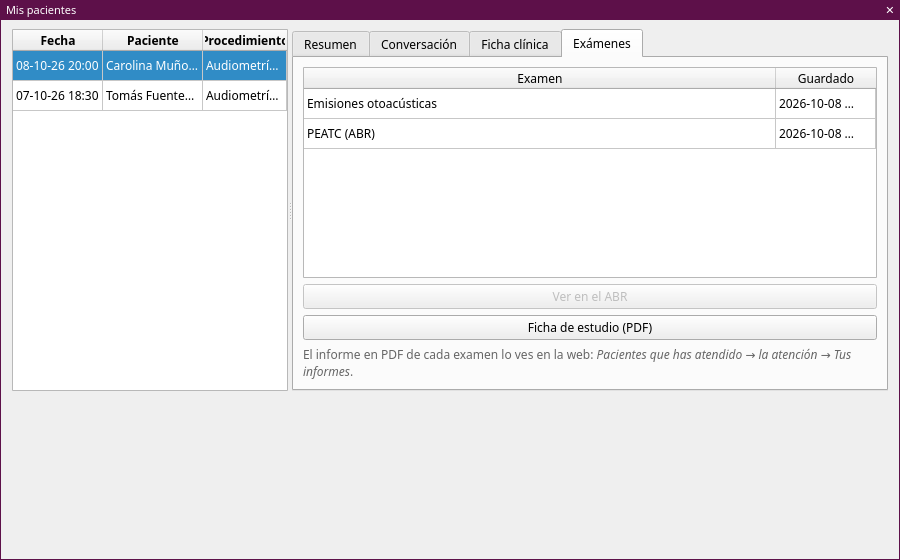

El informe en PDF de cada examen y el resultado de tu técnica de audiometría se ven en la web, desde la actividad del curso: *Ver mis pacientes* (parte III).

---

# Parte III — Tu avance en la web

Lo que haces en LabSim también se ve en la web, desde la actividad del curso: tus pacientes atendidos, cómo va tu técnica, los comentarios de tu docente y los informes en PDF. No hace falta tener LabSim abierto y se puede mirar desde el celular.

## 11. Entrar a la web

La misma página de la actividad LabSim que te da el código de ingreso muestra, debajo, un resumen de tu actividad:

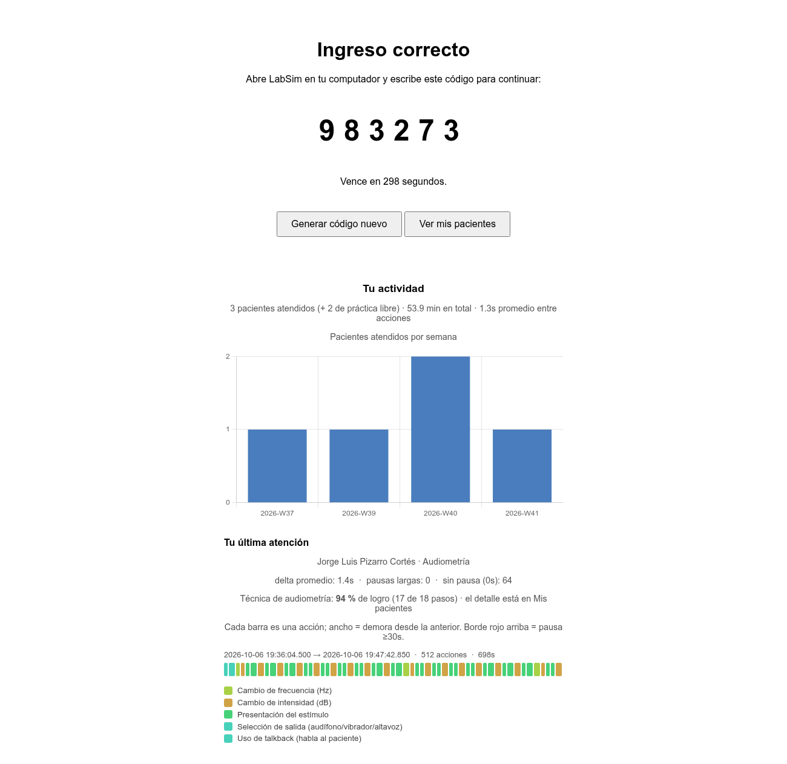

| Parte | Qué dice |
|---|---|
| **Tu actividad** | Pacientes atendidos (los intentos de práctica libre van aparte, entre paréntesis), los minutos en total y el tiempo promedio entre acciones |
| **Pacientes atendidos por semana** | Cuántas atenciones cerraste cada semana |
| **Tu última atención** | Si fue una audiometría, el logro de tu técnica en gráficos: el anillo con el porcentaje de esa atención; al lado, tu logro en cada audiometría, en orden, con esa atención marcada (verde desde 85 %, ámbar desde 60 %), y debajo un cuadrito por cada paso de la técnica (verde si lo cumpliste, rojo si no), agrupados por prueba: → orden, O X aéreos, < > óseos. Con el mouse encima, cada cuadrito dice qué paso es |

**Ver mis pacientes** abre tu página personal, *Mis pacientes atendidos*. El botón de arriba a la izquierda (☀) cambia entre tema claro y oscuro.

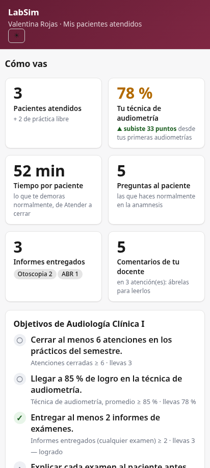

Si dejas la página abierta mucho rato, la sesión vence. Vuelve a la actividad del curso y entra otra vez con *Ver mis pacientes*:

## 12. Cómo vas

La primera parte de *Mis pacientes* resume tu avance:

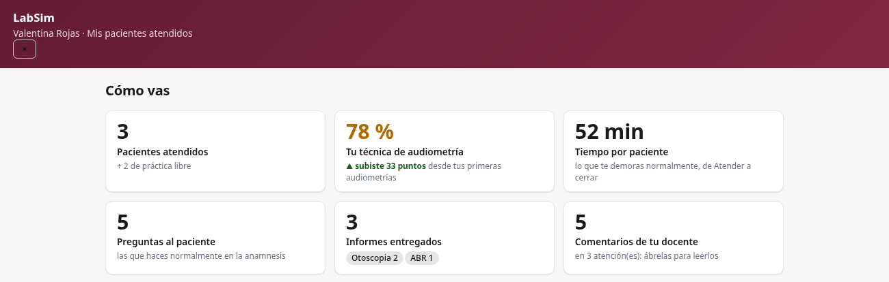

| Tarjeta | Qué cuenta |
|---|---|
| **Pacientes atendidos** | Las atenciones de los prácticos que cerraste; debajo, los intentos de práctica libre |
| **Tu técnica de audiometría** | El logro promedio de tu técnica y cuántos puntos subiste desde tus primeras audiometrías |
| **Tiempo por paciente** | Lo que demoras normalmente, desde *Atender* hasta cerrar |
| **Preguntas al paciente** | Las que haces normalmente en la anamnesis |
| **Informes entregados** | Cuántos informes guardaste, por examen |
| **Comentarios de tu docente** | Cuántos te dejó y en cuántas atenciones |

### 12.1 Objetivos del curso

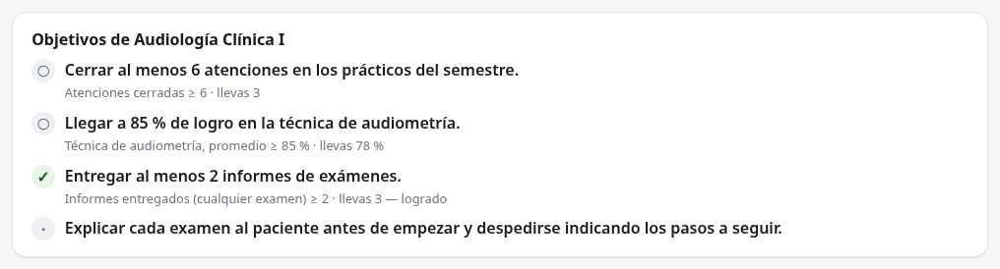

Si tu docente fijó objetivos para el curso, aparecen aquí con tu avance: **✓** cuando ya lo cumpliste y un círculo vacío mientras no. Los objetivos que LabSim no puede medir (por ejemplo, explicar el examen al paciente) aparecen solo como texto: esos los revisa tu docente.

### 12.2 Tu técnica, atención por atención

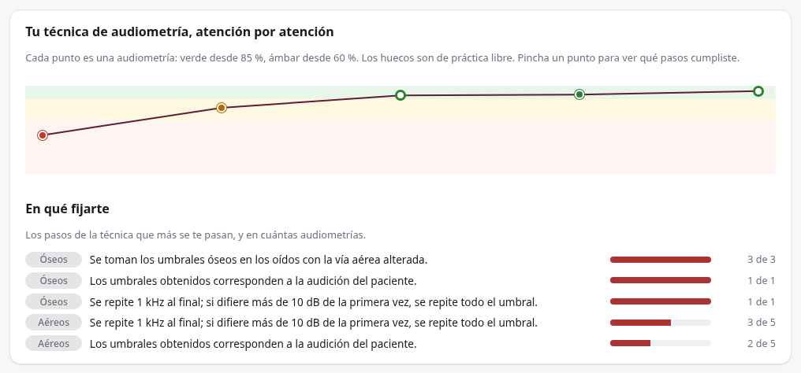

Cada punto del gráfico es una audiometría, en orden: **verde** desde 85 % de logro, **ámbar** desde 60 % y **rojo** bajo eso. Los huecos son intentos de práctica libre. Pincha un punto para ver qué pasos cumpliste en esa atención.

Debajo, **En qué fijarte** junta los pasos de la técnica que más se te pasan y en cuántas audiometrías: *3 de 5* quiere decir que ese paso faltó en 3 de las 5 audiometrías en que correspondía.

## 13. Tus atenciones

### 13.1 La lista

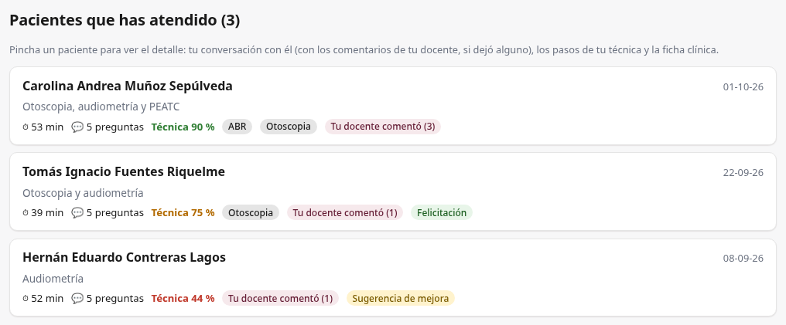

**Pacientes que has atendido** muestra tus atenciones de los prácticos, de la más nueva a la más antigua. Cada una dice el procedimiento, los minutos con el paciente, las preguntas que le hiciste y el logro de tu técnica, y lleva etiquetas para los informes guardados (*ABR*, *Otoscopia*…), los comentarios de tu docente (*Tu docente comentó (N)*) y los mensajes de la OIRS simulada (*Felicitación* o *Sugerencia de mejora*).

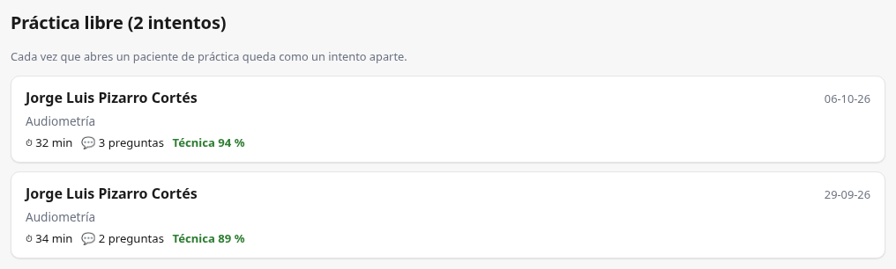

Debajo va **Práctica libre**: cada vez que abriste un paciente de práctica queda como un intento aparte.

Pincha una atención para ver el detalle.

### 13.2 Datos y evolución

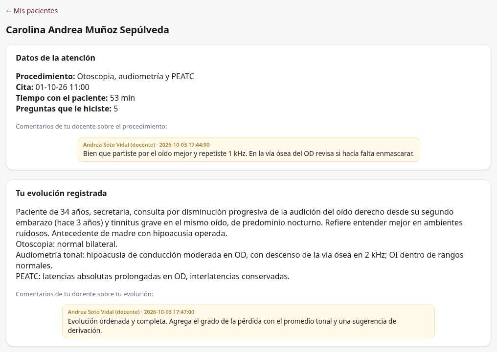

**Datos de la atención** tiene el procedimiento, la cita, el tiempo con el paciente y las preguntas que le hiciste. **Tu evolución registrada** es la evolución que escribiste al cerrar. Bajo cada una, en amarillo, los comentarios de tu docente.

### 13.3 Pasos de la técnica de audiometría

Si la atención tuvo audiometría, esta tarjeta dice qué pasos de la técnica cumpliste: el logro total y, debajo, cada prueba con su porcentaje.

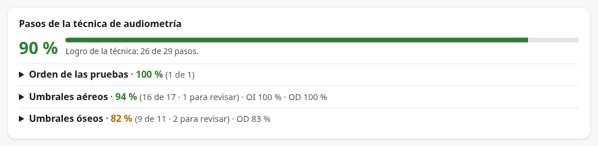

Pincha una prueba para abrirla:

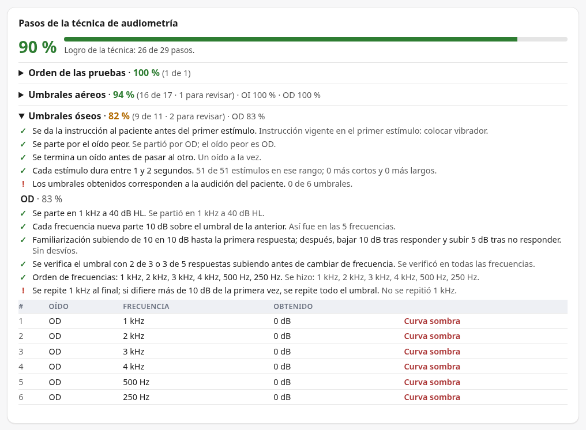

Cada paso lleva **✓** si lo cumpliste o **!** si hay que revisarlo y, en gris, lo que hiciste (por ejemplo, *Se partió en 1 kHz a 40 dB HL* o *No se repitió 1 kHz*). Las reglas por oído van bajo **OD** y **OI**. La tabla final compara cada umbral que obtuviste con la audición del paciente:

| Resultado | Qué significa |
|---|---|
| **Corresponde** | El umbral coincide con la audición del paciente |
| **Curva sombra** | El umbral que obtuviste es el del otro oído, no el del oído evaluado |
| **No corresponde** | El umbral no coincide con la audición del paciente |
| **No verificó 2/3 ni 3/5** | No confirmaste el umbral antes de cambiar de frecuencia |

### 13.4 Informes, mensajes, ficha y conversación

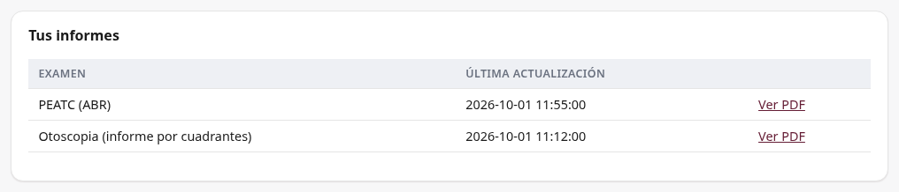

**Tus informes** lista los exámenes que guardaste en esa atención, con la hora de la última actualización. **Ver PDF** abre el informe (sección 14).

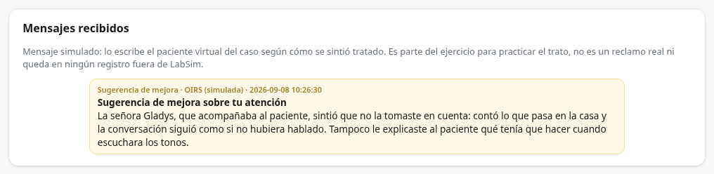

**Mensajes recibidos** junta lo que te llegó por esa atención: los de tu docente y los de la OIRS simulada, los mismos de la *Bandeja de entrada* de LabSim (sección 9).

**Ficha clínica** es la ficha del paciente, con su historial; tu evolución queda como la última entrada.

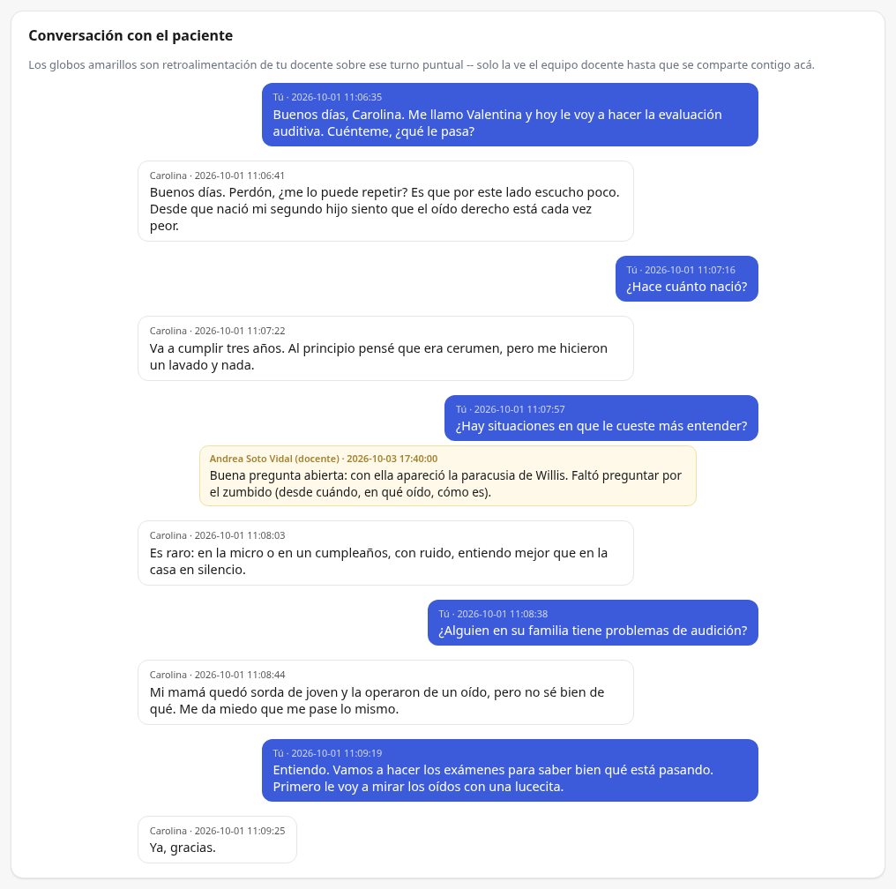

**Conversación con el paciente** es la entrevista completa. Los globos amarillos son comentarios de tu docente sobre ese turno en particular.

En un intento de **práctica libre**, la primera tarjeta es la **Ficha de estudio**, si tu docente la dejó disponible:

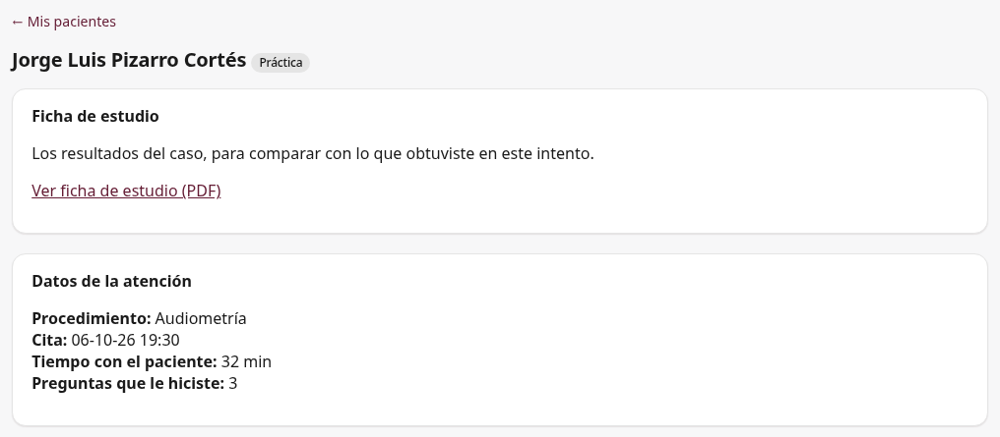

## 14. Los informes y la ficha de estudio en PDF

Cada informe en PDF tiene los datos del paciente, quién lo hizo (*Evaluador*) y la fecha, y después lo que guardaste en el equipo: las curvas y sus valores, los hallazgos y tu conclusión.

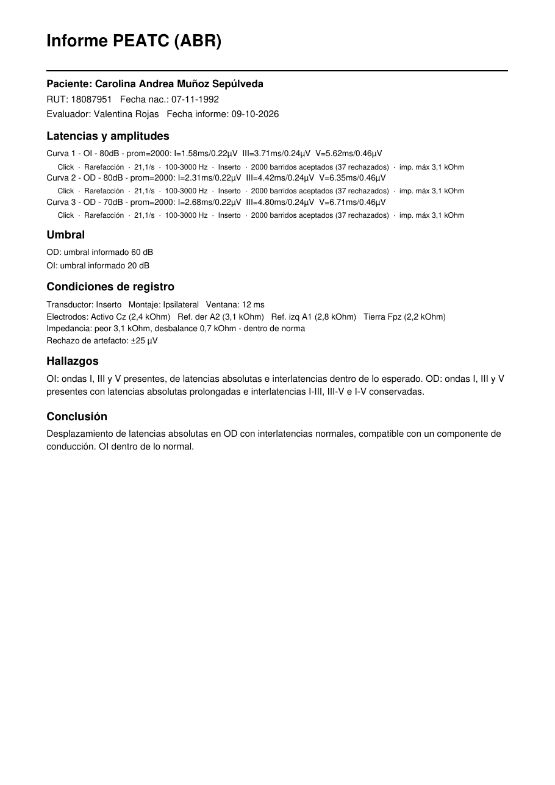 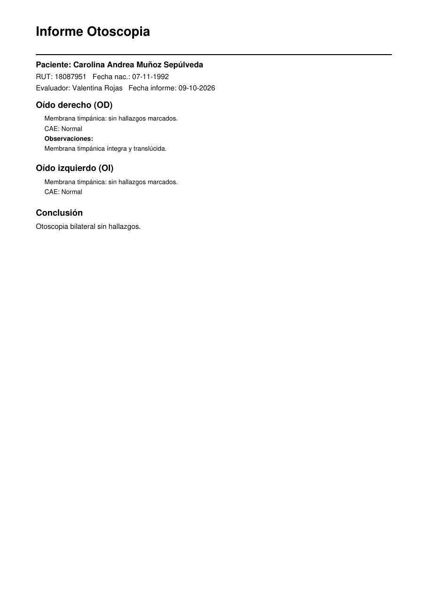

La **ficha de estudio** tiene los resultados del caso, para comparar con lo que obtuviste en tu intento: la anamnesis, la otoscopía, la audiometría, la acumetría, las supraliminares, la logoaudiometría y los demás exámenes del caso. Solo existe para los pacientes de práctica libre, si tu docente la dejó disponible, y se abre después de cerrar al menos un intento.

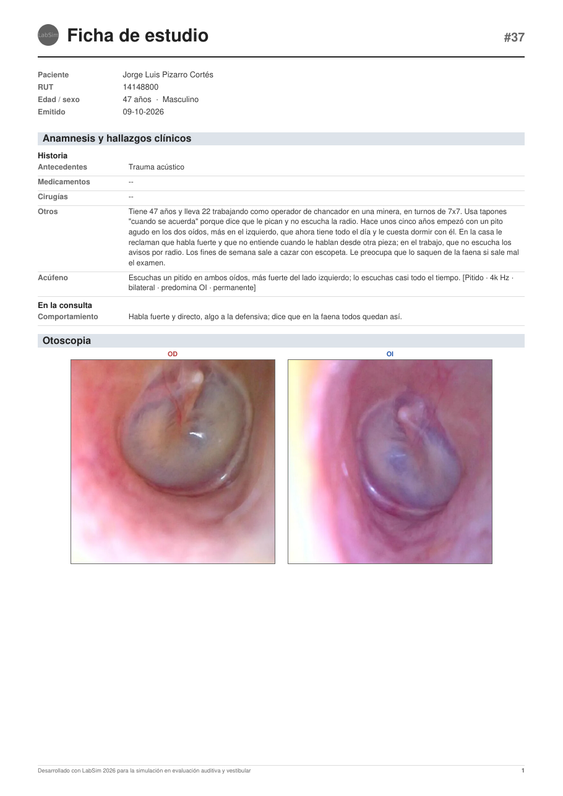 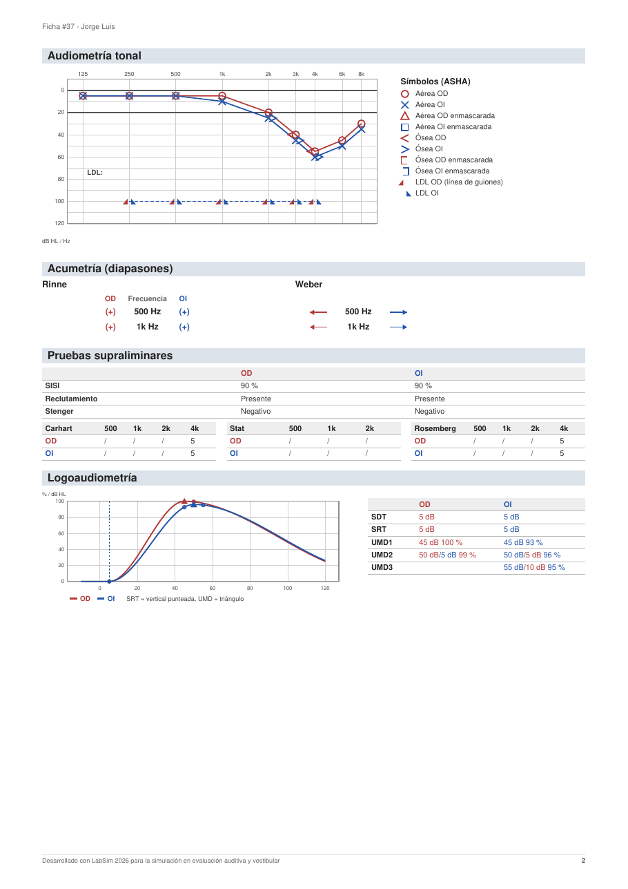

---

# Parte IV — Box Audiología

Los equipos de la audiología: **A** audiómetro, **AC** acumetría, **OT** otoscopía y **Z** impedanciómetro.

## 15. El audiómetro

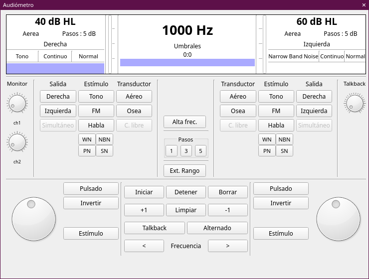

El audiómetro tiene **dos canales**: el **canal 1** a la izquierda y el **canal 2** a la derecha. Cada canal tiene su propia pantalla, sus botones y su perilla de intensidad.

### 15.1 La pantalla

- **Al centro**: la frecuencia (*1000 Hz*), la prueba (*Umbrales* o *Logoaudiometría*) y el cronómetro.
- **Indicador de respuesta**: una franja que se pone **lila** cuando el paciente **levanta la mano**.
- **En cada canal**: la intensidad (*dB HL*), el transductor (*Aerea*, *Oséa*), el paso (*Pasos: 5 dB*), la salida (*Derecha*, *Izquierda*), el estímulo (*Tono*, *Narrow Band Noise*…), el modo (*Continuo*, *Pulsado*, *Alternado*) y si está invertido. El indicador del canal se pone lila mientras suena.

### 15.2 Los controles de cada canal

| Control | Qué hace |
|---|---|
| **Salida** | *Derecha* o *Izquierda*: a qué oído va el canal |
| **Estímulo** | **Tono**, **FM** (tono modulado, *warble*), **Habla**, y los ruidos **NBN** (banda angosta), **WN** (blanco), **SN** (de habla) y **PN** (rosa) |
| **Transductor** | **Aéreo** (fonos) u **Osea** (vibrador) |
| **Perilla** | Sube y baja la intensidad, según el paso elegido |
| **Pulsado** | El tono suena en pulsos (medio segundo sí, medio no) mientras mantienes *Estímulo* |
| **Invertir** | El canal queda sonando continuo y *Estímulo* lo silencia: así se deja el ruido enmascarante encendido |
| **Estímulo** (botón grande) | Presenta el estímulo **mientras lo mantienes apretado** |

### 15.3 Los controles del centro

| Control | Qué hace |
|---|---|
| **Frecuencia** **<** **>** | Cambia la frecuencia: 125 a 8000 Hz |
| **Pasos 1 · 3 · 5** | El paso de la intensidad, en dB |
| **Ext. Rango** | Extiende el máximo de la vía aérea de 100 a 120 dB HL |
| **Alta frec.** | Suma las frecuencias de 9 a 16 kHz |
| **Alternado** | Pone los dos canales en modo alternado (un oído y el otro) |
| **Talkback** | Le dice al paciente la instrucción elegida en *Comandos de voz* (sección 16) |
| **Monitor ch1 / ch2** | El volumen de cada canal en tus fonos |
| **Iniciar · Detener · Borrar** | El cronómetro de la pantalla |
| **+1 · -1 · Limpiar** | Los aciertos de la logoaudiometría (sección 18) |

Los límites de intensidad son los del equipo: la vía aérea va de -15 a 100 dB HL (120 con *Ext. Rango*) y la vía ósea tiene máximos más bajos en los graves.

## 16. Las instrucciones al paciente

El paciente responde según la **última instrucción** que le diste. Las instrucciones se eligen en la ventana **Comandos de voz** y se le dicen con **Talkback**.

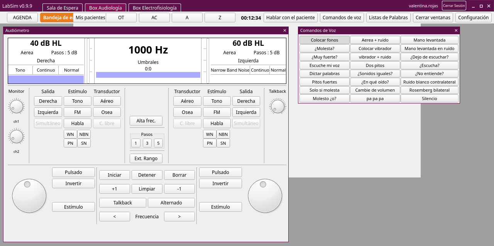

1. Con el audiómetro abierto, botón **Comandos de voz** (arriba a la derecha).
2. Elige la instrucción. Dejando el mouse encima ves el texto completo que escucha el paciente.
3. Presiona **Talkback** en el audiómetro. Recién ahí el paciente recibe la instrucción.

| Instrucción | Para | Qué hace el paciente |
|---|---|---|
| **Colocar fonos** / **Colocar vibrador** | Umbrales sin enmascarar | Levanta la mano mientras suena un tono que oye |
| **Aerea + ruido** / **vibrador + ruido** | Umbrales enmascarados | Igual, con ruido en el otro oído (sección 17) |
| **Escuche mi voz** | Umbral de detección de la voz | Con *Habla* y *pa pa pa* elegido, levanta la mano si lo oye |
| **Pitos fuertes** | Umbral de molestia (LDL) | Dice *«molesta»* cuando el tono le molesta |
| **Cambie de volumen** | SISI | Dice *«sí»* cuando nota que el tono subió |
| **Dos pitos**, luego **¿Sonidos iguales?** o **¿En qué oído?** | Fowler | Contesta si los dos tonos suenan igual o en qué oído suena más fuerte |
| **Mano levantada** | Deterioro tonal (Carhart) | Mantiene la mano arriba mientras siga oyendo el tono |
| **Rosemberg bilateral** | Deterioro tonal (Rosemberg) | Igual que Carhart |
| **Ruido blanco contralateral** | STAT | Mantiene la mano arriba mientras siga oyendo el tono |
| **Mano levantada en ruido** | Stenger | Levanta la mano con los dos canales sonando |

> Cualquier otra instrucción **reemplaza** la anterior. Si después de *Pitos fuertes* le preguntas *¿Molesta?*, el paciente deja de responder a la LDL hasta que repitas *Pitos fuertes*.

## 17. Enmascaramiento

Para enmascarar, usa el **canal 1 para el tono** y el **canal 2 para el ruido**, en el oído contrario:

1. Instrucción **Aerea + ruido** (o **vibrador + ruido** para la vía ósea) y *Talkback*.
2. Canal 2: salida al **oído contrario**, estímulo **NBN**, **WN** o **PN**, y el transductor que corresponda. Con **Invertir** el ruido queda encendido.
3. Canal 1: el tono al oído que estás evaluando, como siempre.

El paciente responde según el nivel del ruido, como uno real: con poco ruido sigue oyendo el tono por el otro oído (curva sombra); con el ruido justo responde con su umbral real; con demasiado ruido deja de oír.

## 18. Logoaudiometría y listas de palabras

Elegir **Habla** como estímulo cambia la prueba a **Logoaudiometría**: la pantalla muestra los aciertos (*0/25 : 0%*) y el otro canal pasa a **Speech Noise**. En logoaudiometría solo se enmascara con **SN**.

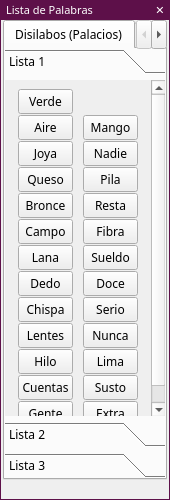

1. Con *Habla* en un canal, botón **Listas de Palabras**.
2. Elige la lista: **Disilabos (Palacios)** o **Terminos Conocidos**. Las palabras desactivadas todavía no tienen su grabación: dejando el mouse encima dice cuál falta.
3. Haz clic en una palabra: suena por la salida del canal. El paciente la repite (o dice otra cosa, si no la entendió).
4. Anota con **+1** o **-1** en el audiómetro. **<** y **>** cambian el total de palabras; **Limpiar** vuelve los aciertos a cero.

Para volver a los umbrales, elige **Tono** o **FM**.

## 19. Pruebas supraliminares

Todas se hacen con el audiómetro y la instrucción de la tabla de la sección 16.

- **SISI**: instrucción *Cambie de volumen*, paso **1** dB. Con el tono sonando, sube la intensidad de a 1 dB; el paciente dice *«sí»* cuando lo nota. Las subidas de 5 dB las nota siempre (sirven para familiarizarlo).
- **Fowler**: los dos canales en *Tono*, uno a cada oído, **Alternado**, e instrucción *Dos pitos*. Manteniendo *Estímulo*, elige *¿Sonidos iguales?* o *¿En qué oído?* y *Talkback*: el paciente contesta. Para otra frecuencia, repite *Dos pitos*.
- **Deterioro tonal**: tono **continuo** por vía aérea en 500, 1000, 2000 o 4000 Hz, e instrucción *Mano levantada* (Carhart) o *Rosemberg bilateral*. El paciente mantiene la mano arriba mientras oye; cronometra con *Iniciar / Detener / Borrar*. El minuto es real.
- **LDL**: instrucción *Pitos fuertes*. El paciente dice *«molesta»* al **presentar** el tono a una intensidad que le molesta.
- **Stenger**: instrucción *Mano levantada en ruido*, con los dos canales sonando, uno a cada oído.

## 20. Acumetría

**AC** abre la acumetría con diapasones de **500 Hz** y **1000 Hz**. Abajo de cada prueba, un registro va mostrando lo que haces y lo que contesta el paciente.

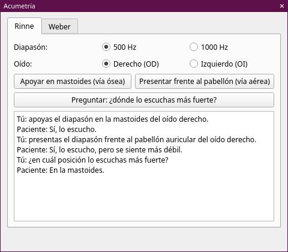

**Rinne** (pestaña *Rinne*):

1. Elige el **diapasón** y el **oído**.
2. **Apoyar en mastoides (vía ósea)**.
3. **Presentar frente al pabellón (vía aérea)**.
4. **Preguntar: ¿dónde lo escuchas más fuerte?**

**Weber** (pestaña *Weber*): elige el diapasón y **Apoyar en la frente / vértex**. El paciente dice en qué oído lo escucha más fuerte, o si lo escucha igual.

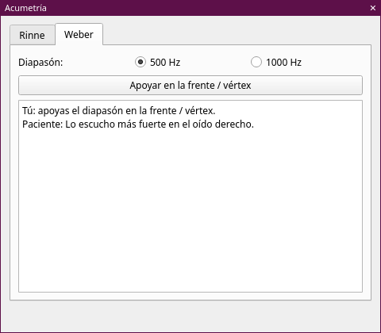

LabSim no te da el resultado: la interpretación la concluyes tú con lo que contestó el paciente.

## 21. Otoscopía

**OT** abre el otoscopio, con un visor para cada oído.

- Mueve el mouse sobre el visor para **mirar por el otoscopio**: se ve un círculo de luz que sigue al cursor; fuera del visor, todo queda negro.
- **Cono pediátrico** o **Cono adulto** cambia el tamaño del campo que se ve.

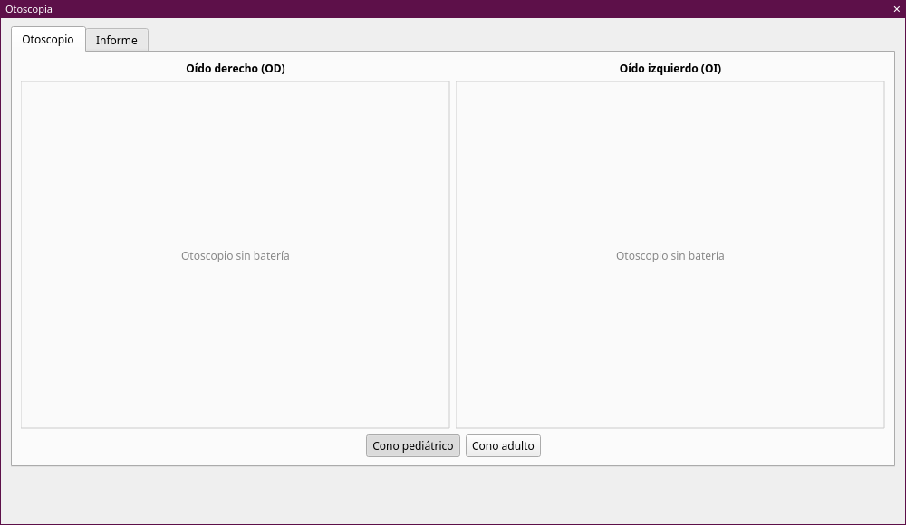

En la pestaña **Informe** marcas lo que viste:

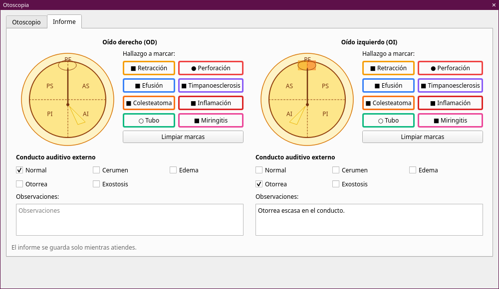

1. Elige el hallazgo (**Retracción**, **Perforación**, **Efusión**, **Timpanoesclerosis**, **Colesteatoma**, **Inflamación**, **Tubo**, **Miringitis**).
2. Haz clic en el cuadrante del esquema donde lo viste (AS, AI, PI, PS o la pars flácida, PF). Puedes poner varios hallazgos en un cuadrante; otro clic con el mismo hallazgo lo quita. Sin hallazgo elegido, el clic vacía el cuadrante.
3. Marca el **conducto auditivo externo** (*Normal*, *Cerumen*, *Edema*, *Otorrea*, *Exostosis*) y escribe tus **observaciones**.

**Limpiar marcas** borra el esquema de ese oído.

## 22. Impedanciómetro

**Z** abre el impedanciómetro. Las teclas bajo la pantalla cambian de función según la pantalla; su nombre aparece en la fila de abajo de la pantalla.

### 22.1 Timpanometría

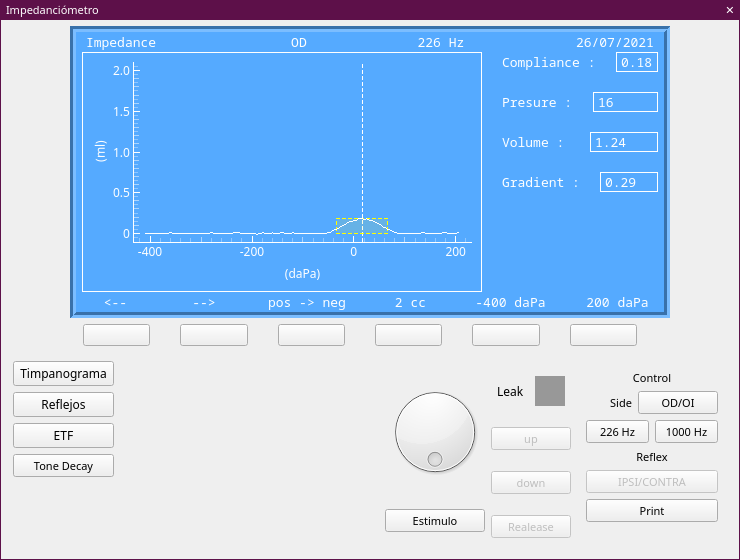

1. Elige la sonda (**226 Hz** o **1000 Hz**) y el oído con **OD/OI**.
2. **Estimulo** (o la tecla **V**): la curva se dibuja con el tono de la sonda. Otro clic la detiene.
3. Ajusta el pico con las teclas **<--** y **-->**: la presión, la compliance y el gradiente se recalculan.

Las otras teclas cambian la dirección del barrido, la escala (en cc) y los límites del barrido (en daPa). A la derecha de la curva: *Compliance*, *Presure*, *Volume* y *Gradient*.

### 22.2 Reflejos

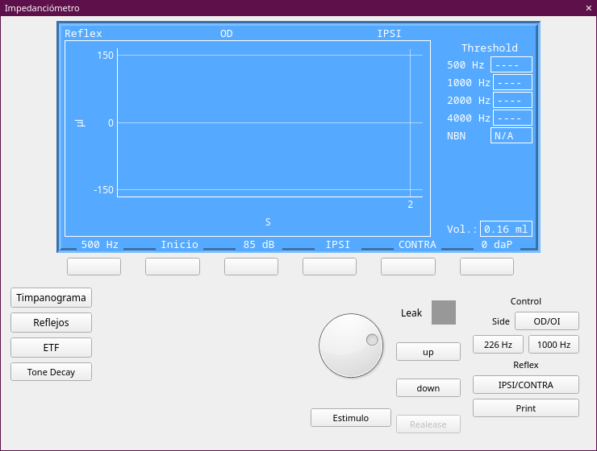

1. **Reflejos**, y elige **IPSI** o **CONTRA** (también con un clic sobre la pantalla).
2. Elige la frecuencia con la primera tecla (*NBN* solo existe en CONTRA).
3. Ajusta la intensidad con la perilla (de a 5 dB) y presiona **Inicio**: se dibuja la respuesta.

Cuando hay reflejo, la curva baja mientras dura el tono y vuelve a la línea base al terminar, y el equipo anota en la tabla (*Threshold*) la intensidad que usaste. Sin reflejo, la curva queda plana.

### 22.3 Tone Decay

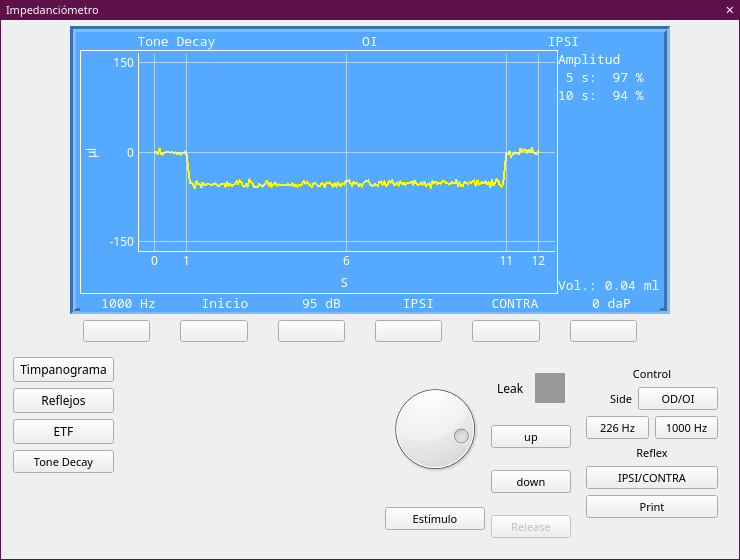

1. **Tone Decay**, y elige **IPSI** o **CONTRA** (con *IPSI/CONTRA* o con un clic sobre la pantalla).
2. La primera tecla elige la frecuencia: **500** o **1000 Hz**.
3. Ajusta la intensidad con la perilla y presiona **Inicio** (o *Estímulo*): el tono dura **10 segundos**.

La curva muestra la contracción durante los 10 s y, a la derecha, cuánto de la amplitud inicial queda a los **5 s** y a los **10 s**. Si no hay reflejo a esa intensidad, la curva queda plana y no hay porcentaje.

### 22.4 Función tubaria (ETF)

La pantalla **ETF** tiene dos pruebas; la primera tecla (**Prueba**) cambia entre ellas. Cuál corresponde lo decides tú, según lo que viste en la otoscopía y en el timpanograma.

**Membrana íntegra.** Se comparan timpanogramas antes y después de tragar con el conducto presurizado:

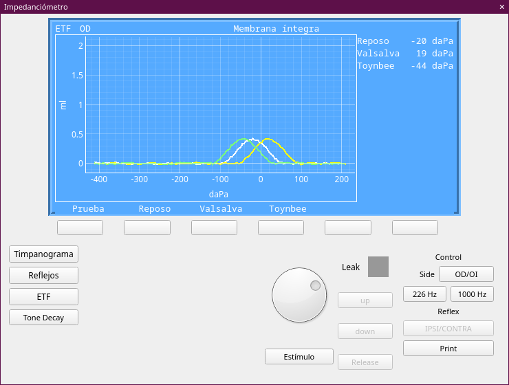

1. **Reposo**: el timpanograma de partida (blanco).
2. **+400 trag**: el equipo presuriza el conducto a +400 daPa, el paciente traga y se repite el timpanograma (amarillo).
3. **-400 trag**: lo mismo con -400 daPa (verde).

A la derecha queda la presión del pico de cada timpanograma. Las diferencias son de pocos daPa: compáralas con cuidado.

**Membrana perforada (o con tubo).** Se presuriza el conducto y el paciente traga:

1. Con la perilla, elige la presión (por ejemplo, -200 o +200 daPa).
2. **Inicio**: durante 10 s el paciente traga tres veces (las líneas *trague*).

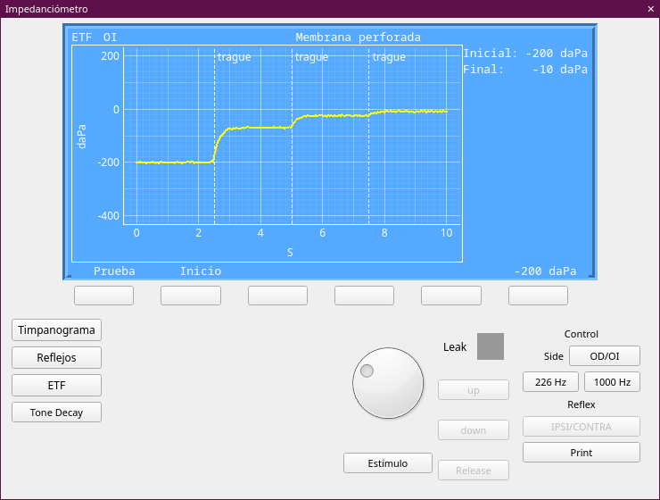

A la derecha quedan la presión inicial y la final.

---

# Parte V — Box Electrofisiología

Los equipos de electrofisiología: **ABR**, **AABR**, **VEMP** y **EOAS**. Estos equipos ocupan toda la ventana.

## 23. ABR

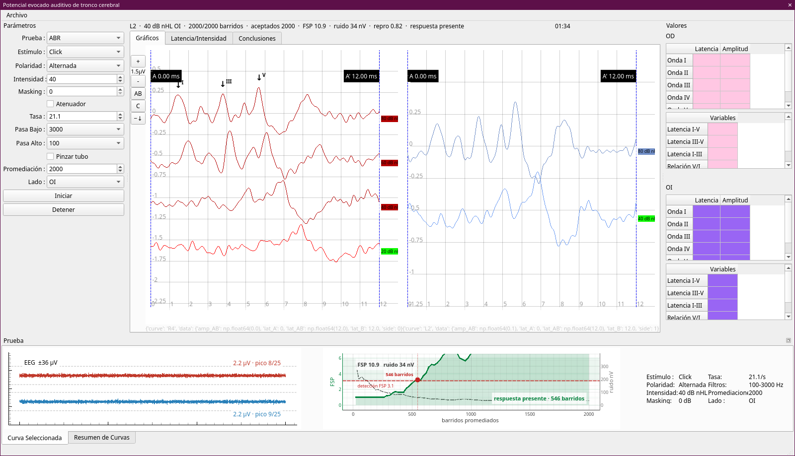

La ventana del ABR tiene:

- **Parámetros** (izquierda): la prueba, el estímulo, la polaridad, la intensidad, el masking, la tasa, los filtros, las promediaciones y el lado.
- **Gráficos** (centro): las curvas de OD (rojo) y OI (azul). Cada curva nueva se apila debajo de la anterior, con su intensidad al costado.
- **Valores** (derecha): las latencias y amplitudes que marcas, y los interpicos que se calculan solos.
- **Prueba** (abajo): el **EEG** en vivo, el **FSP** y el ruido residual de la curva que se está registrando.

### 23.1 Configurar el equipo

El equipo **no viene configurado**: la tasa y las promediaciones arrancan al azar, y configurarlo es parte del examen.

- **Prueba**: **ABR** o **ECochG** (sección 24). Las demás aparecen como *en desarrollo*.
- **Estímulo**: *Click*, *CE-Chirp*, *CE-Chirp LS*, *NB CE-Chirp LS* (500 Hz a 4 kHz) y *Burst* (500 Hz a 4 kHz).
- **Polaridad**: *Alternada*, *Condensación* o *Rarefacción*.
- **Archivo → Párametros Avanzados**: el transductor, el montaje, la ventana, la ganancia, los filtros y, en la pestaña *Registro*, los **electrodos**: la posición y la impedancia de cada uno (activo, referencias y tierra).

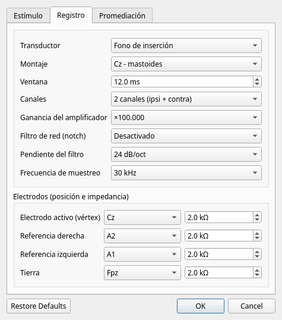

### 23.2 Registrar

1. **Iniciar**. La curva se registra en vivo; la línea de arriba dice cuántos barridos van, el FSP, el ruido y si hay rechazo.
2. **Pausar** / **Continuar** o **Detener**; si no, termina sola.
3. Cambia la intensidad (o el lado) y vuelve a **Iniciar** para la siguiente curva.

Mira el **EEG** abajo: si el paciente está inquieto o un electrodo está mal, se nota ahí antes de promediar.

### 23.3 Marcar las ondas

Cada gráfico tiene dos banderas verticales que se arrastran: **A** y **A'**.

1. Elige la curva con un clic en **su etiqueta de intensidad** (el recuadro a la derecha de la curva).
2. Lleva la bandera **A** al pico de la onda.
3. En la tabla **Valores**, haz clic en la celda **Latencia** de esa onda: se escribe la latencia y aparece la flecha sobre la curva.
4. Para la amplitud, deja **A** en el pico y **A'** en el valle siguiente, y haz clic en **Amplitud**.

Los interpicos (I-V, III-V, I-III) y la relación V/I se calculan solos; lo que queda fuera de la norma se pinta en rojo. Con el botón derecho sobre el gráfico: *Eliminar curva*, *Eliminar marcas* y *Suavizar*. Los botones **+** y **-** agrandan o achican las curvas.

### 23.4 Latencia/intensidad y conclusiones

La pestaña **Latencia/Intensidad** grafica las latencias que marcaste contra la intensidad, sobre la banda normal.

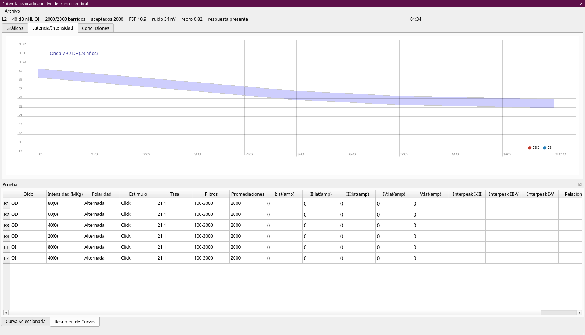

En **Conclusiones** escribes la **Descripción** y la **Conclusión** del examen. El informe se guarda solo, con las curvas y sus marcas.

Si el paciente tiene un ABR de una atención anterior, arriba aparece **Sesión:** con las sesiones anteriores: elegir una la muestra **solo para mirar**.

## 24. Electrococleografía

La electrococleografía vive dentro del ABR: en **Prueba**, elige **ECochG**. El equipo cambia a un montaje timpánico y una ventana de 10 ms, y la tabla de valores cambia a la del ECochG.

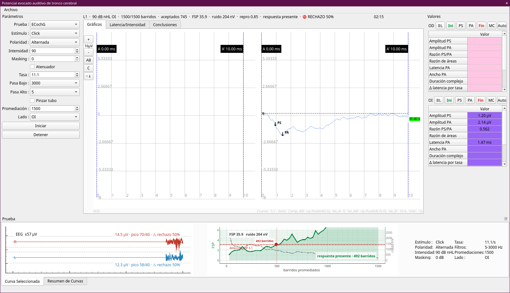

1. Registra como en el ABR (*Click* o *Burst*).
2. Elige la curva (clic en su etiqueta) y lleva la bandera **A** a cada punto.
3. Pulsa el botón de la marca en la tabla: **BL** (línea de base), **Ini**, **PS**, **PA**, **Fin** y **MC** (microfónica).

La tabla calcula la amplitud del PS y del PA, la **razón PS/PA**, la razón de áreas y las latencias; lo que queda fuera de la norma se pinta en rojo. **Auto** marca la curva elegida de forma automática (todo menos MC). Las medidas de tasa necesitan dos curvas del mismo oído a distinta tasa.

Cambiar de prueba no borra nada: el ABR y el ECochG se guardan por separado.

## 25. AABR

**AABR** es el equipo de tamizaje automatizado.

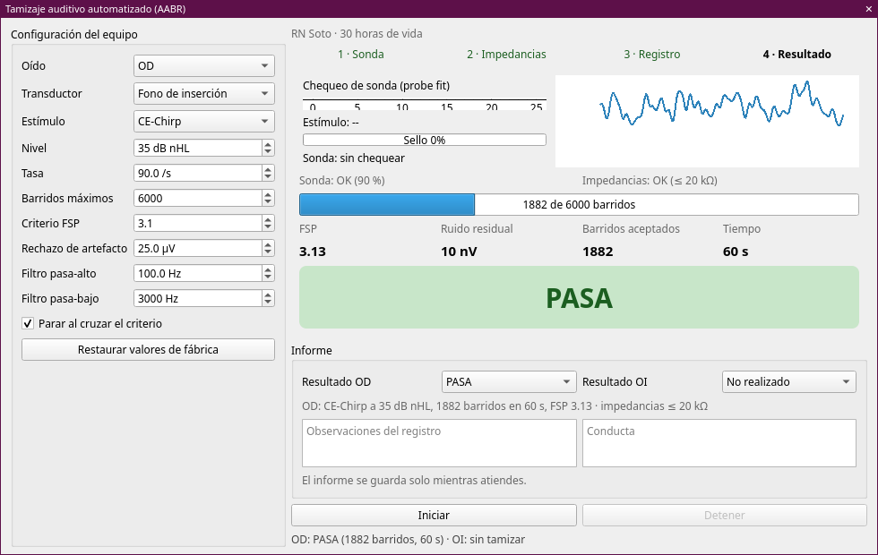

1. Revisa la **configuración del equipo** a la izquierda (oído, estímulo, nivel, criterio). **Restaurar valores de fábrica** la devuelve a la original.
2. **Iniciar**. El equipo hace solo los cuatro pasos: **1 · Sonda**, **2 · Impedancias**, **3 · Registro** y **4 · Resultado**.
3. El resultado sale en grande: **PASA** o **REFIERE**.

Si la sonda no sella, se detiene en el paso 1: acomódala y vuelve a iniciar. En **Informe**, el resultado de cada oído queda precargado; completa las **observaciones del registro** y la **conducta**.

## 26. Emisiones otoacústicas

**EOAS** abre el emisor otoacústico, con una pestaña por prueba: **TEOAE**, **DPOAE**, **SOAE**, **SFOAE** e **Informe**.

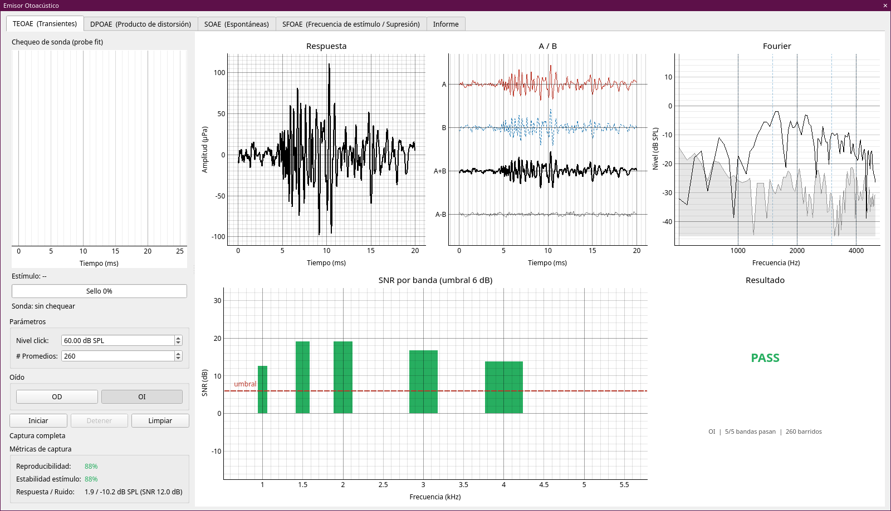

Todas funcionan igual:

1. Elige el **oído** (OD u OI) y los parámetros (nivel, promedios).
2. **Iniciar**. El equipo chequea la sonda y registra; al final muestra el resultado.
3. **Limpiar** borra la captura de ese oído.

| Prueba | Qué muestra al final |
|---|---|
| **TEOAE** | La respuesta, los trazos A/B, el espectro y la **SNR por banda**, con **PASS** o **REFER** |
| **DPOAE** | El **DP-grama** con los dos oídos superpuestos y la tabla por frecuencia (PASS / REFER) |
| **SOAE** | El espectro sin estímulo y los picos encontrados |
| **SFOAE** | La magnitud y la fase contra el nivel del supresor, y la curva de sintonía |

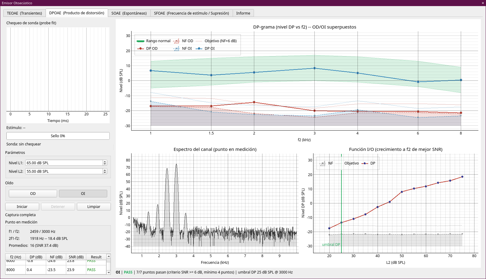

En **Informe** escribes la descripción y la conclusión; las pruebas que capturaste se adjuntan solas.

## 27. VEMP

**VEMP** abre los potenciales vestibulares: **cVEMP** (cervical), **oVEMP** (ocular) y **mVEMP** (masetérico).

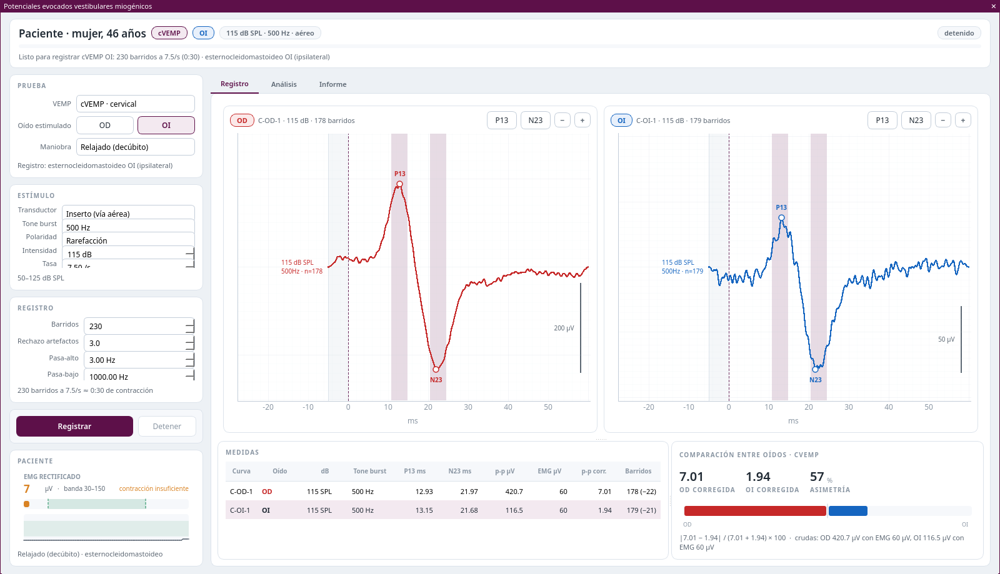

1. En **Prueba**, elige el VEMP, el **oído estimulado** y la **maniobra** (la posición o la contracción que le pides al paciente). Debajo dice en qué músculo se registra.
2. En **Estímulo** y **Registro**, el transductor, el *tone burst*, la intensidad, la tasa, los barridos y los filtros. Como en el ABR, los parámetros del registro arrancan al azar.
3. **Registrar**. Mira el **EMG rectificado** del paciente: debe quedar *en banda*; con poca contracción el equipo rechaza barridos.
4. Para marcar, pulsa el botón del pico (**P13**, **N23**, o **N10**, **P16** en el oVEMP) y haz clic sobre la curva.

La tabla **Medidas** junta las curvas, y **Comparación entre oídos** calcula la asimetría con las amplitudes corregidas por el EMG. En **Análisis** están el crecimiento con la intensidad, la sintonía y las latencias; en **Informe**, los hallazgos y la conclusión.

---

# Parte VI — Ajustes y problemas

## 28. Configuración

**Configuración** (arriba a la derecha) tiene tres pestañas. Lo que guardes queda en tu perfil y te sigue a cualquier computador.

### 28.1 Atajos de teclado

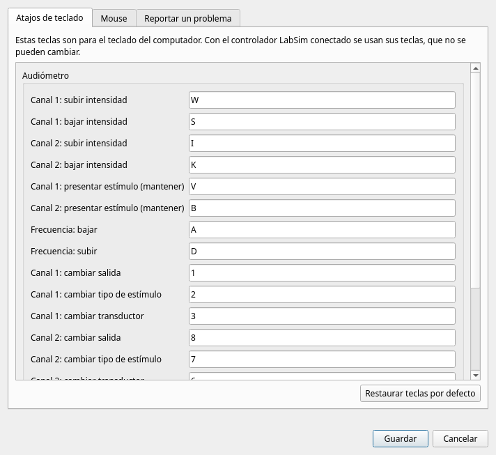

El audiómetro y el impedanciómetro se pueden manejar con el teclado. Las teclas de fábrica:

| Acción | Tecla |
|---|---|
| Canal 1: subir / bajar intensidad | **W** / **S** |
| Canal 2: subir / bajar intensidad | **I** / **K** |
| Canal 1 / canal 2: presentar estímulo (mantener) | **V** / **B** |
| Frecuencia: bajar / subir | **A** / **D** |
| Canal 1: salida / estímulo / transductor | **1** / **2** / **3** |
| Canal 2: salida / estímulo / transductor | **8** / **7** / **6** |
| Impedanciómetro: subir / bajar el dial | **W** / **S** |
| Impedanciómetro: estímulo | **V** |

Puedes cambiar cualquiera; **Restaurar teclas por defecto** vuelve a las de fábrica. Las teclas **5** y **E** están reservadas en el audiómetro. Los atajos funcionan mientras el equipo esté abierto, salvo cuando escribes en un campo de texto.

### 28.2 El controlador LabSim

En el laboratorio, el audiómetro se maneja con el **controlador LabSim**: botones, dos perillas (una por canal) y dos teclas de estímulo. Cuando está conectado, LabSim usa sus teclas y la pestaña lo indica; las teclas del controlador no se pueden cambiar.

### 28.3 Mouse para zurdos

En la pestaña **Mouse**, **Mouse para zurdos** intercambia los botones izquierdo y derecho. Se aplica en los computadores del laboratorio; en otro computador, configúralo en el sistema.

## 29. Reportar un problema

Si LabSim se cerró solo, se colgó o algo no funcionó, avísalo desde **Configuración → Reportar un problema**:

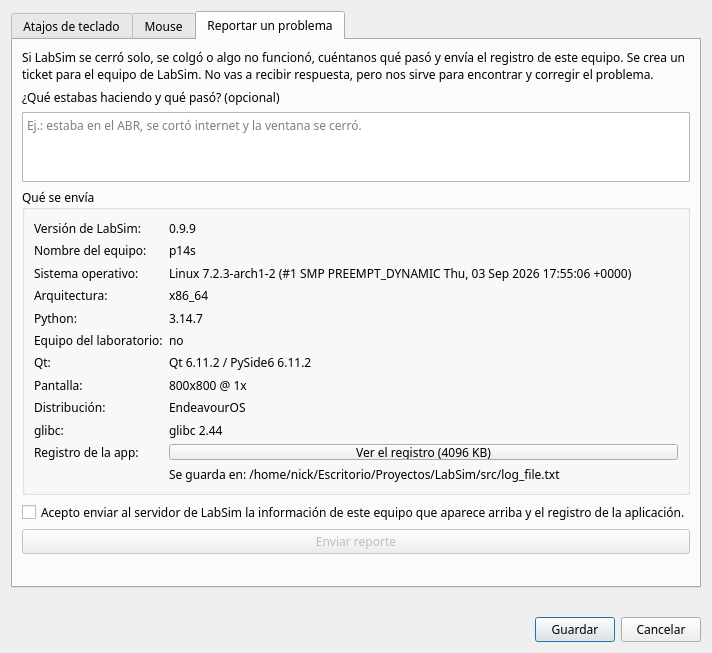

1. Cuenta qué estabas haciendo y qué pasó.
2. Revisa en *Qué se envía* los datos del computador; **Ver el registro** muestra el registro de la app.
3. Marca la casilla de aceptación y **Enviar reporte**. LabSim te da el número del reporte.

## 30. Problemas frecuentes

| Problema | Qué hacer |
|---|---|
| El código de ingreso no sirve | Se usa una vez y vence en minutos: genera uno nuevo |
| No aparece un equipo | Tu curso no lo tiene habilitado; consulta a tu docente |
| *Atención abierta* al querer atender | Cierra primero la atención que tienes (*Cerrar/Evolucionar*) |
| El paciente no levanta la mano | Revisa que le diste la instrucción con **Talkback** y que el canal suena (indicador lila) |
| *Listas de Palabras* no abre | Primero elige **Habla** en un canal del audiómetro |
| Una palabra de la lista está desactivada | Todavía no tiene su grabación; usa otra |
| Una ventana quedó tapada o fuera de la pantalla | **Cerrar ventanas** y vuelve a abrir el equipo |
| *sin conexión* bajo un equipo | Sigue trabajando: se guarda en el computador y se sube cuando vuelva internet |
| *Sesión vencida* | Vuelve a ingresar con un código nuevo; lo hecho no se pierde |
| *No se pudo cerrar la atención* | Lo hecho quedó guardado; vuelve a guardar la evolución cuando haya conexión |
| LabSim se cerró solo | Al volver a abrir, acepta enviar el registro, o usa *Reportar un problema* |
